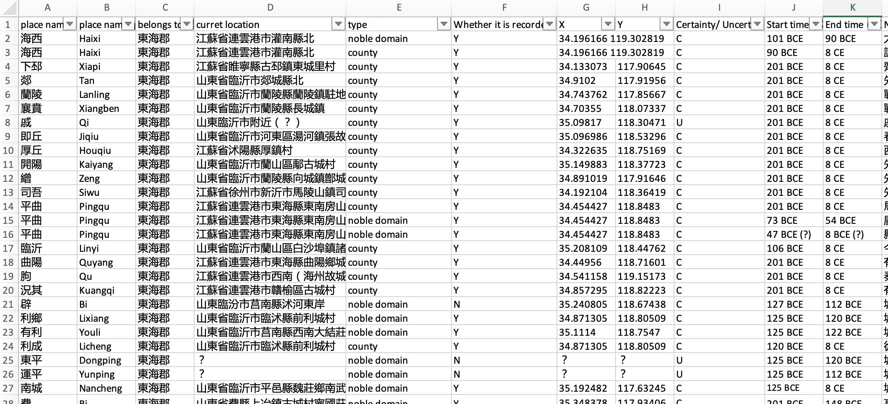

# excel-splitter
<!-- PROJECT LOGO -->
<br />
<div align="center">
  <a href="https://github.com/WesternHanMap">
    
  </a>

  <h3 align="center">Automatic Excel Sub-Sheet Splitter Based On Key Time Stamps</h3>

  <p align="center">
    <br />
    <a href="https://github.com/WesternHanMap/excel-splitter"><strong>Explore the docs »</strong></a>
    <br />
    <br />
    <a href="https://github.com/WesternHanMap/excel-splitter">Report Bug</a>
    ·
    <a href="https://github.com/WesternHanMap/excel-splitter">Request Feature</a>
  </p>
</div>

<!-- ABOUT THE PROJECT -->
## About
<div>
  <a href="https://github.com/WesternHanMap">
    
  </a>
</div>
<p>
  In the Mapping Western Han Project, we deal with numerous record of changes in one kingdom. This tool reads the excel files, detect the key timestamps in the history, and outputs the corresponding existed counties & noble domains in sub-sheets in between each pair of key time stamps.

Here's why:
* Ruoxuan's time should be focused on creating something more amazing.
* Someone does not want to waste on her recent paid chatGPT :smile:
</p>
<p align="right">(<a href="#readme-top">back to top</a>)</p>


### Built With
[![Python][Python]][Python-url]
<p align="right">(<a href="#readme-top">back to top</a>)</p>

<!-- GETTING STARTED -->
## Getting Started

### Prerequisites

If you already have pip, make sure to update it to the lastest version
  ```sh
  -m pip install --upgrade pip
  ```

### Installation

1. Clone the repo
   ```sh
   git clone https://github.com/WesternHanMap/excel-splitter.git
   ```
3. Install pip packages: pandas, xlsxwritter
   ```sh
   pip install pandas
   pip install xlsxwritter
   ```
4. Upload all the excel files that you want to use in the local folder `pythonProject/xlsx`
5. Open up `pythonProject/main.py` and click run, or run the following script
   ```js
   python main.py;
   ```
6. Now the `splitted` xlsx files should be located in the same folder where you uploaded the raw `xlsx` files.


<p align="right">(<a href="#readme-top">back to top</a>)</p>

<!-- MARKDOWN LINKS & IMAGES -->
<!-- https://www.markdownguide.org/basic-syntax/#reference-style-links -->
[Python]: https://img.shields.io/badge/python-3670A0?style=for-the-badge&logo=python&logoColor=ffdd54
[Python-url]: https://www.python.org/
